# 哈希

## 1.两数之和

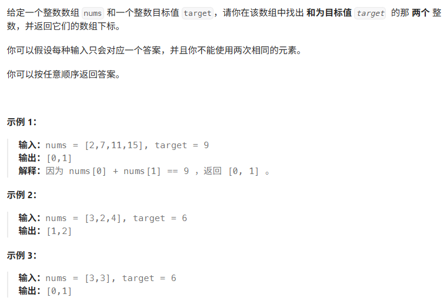

要求时间复杂度小于 o(n2)，所以我们要利用**哈希查询的时间复杂度为o(1)**的特点。

遍历nums，假设当前处于7，则此时哈希表已经有7以前的数组信息，若target-7存在于哈希表则成功找到，若不存在则继续遍历。

以示例1：

- 对于15，相当于找15以前的数字中存不存在 target-15
- 对于11，相当于找11以前的数字中存不存在 target-11
- 对于7，相当于找7以前的数字中存不存在 target-7

该题解存在一个独特的性质，就是**每个元素往数组头寻找（回头看）**，这是因为必须遍历到某元素才能将其存入哈希表。


## 49.字母异位词分组

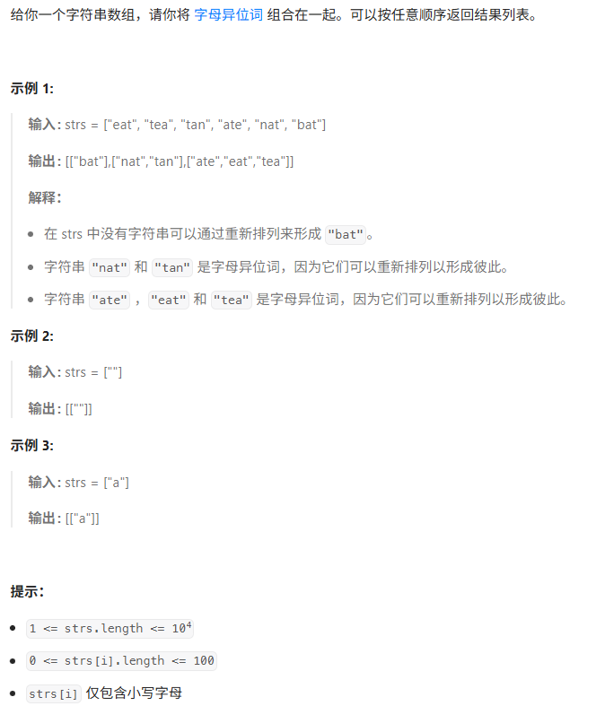

从示例1看，我们需要为结果数组中被归为一个类别的若干字符串寻找到共同的特征，将该特征量化为key，那么就是一个哈希表（其中，key是共同特征，value是原始字符串的列表），最终通过 list(dict.values()) 便可得到返回值。

现在变为了**构造合乎题意的哈希表**：

考虑到该哈希表的value是列表，所以使用 mp = collections.defaultdict(list) 来让**无值的键被访问时自动初始化值为[]**。

关于共同特征，有两种量化方式：

1. sorted(str)，即将字符串**排序**，返回为list，时间复杂度为o(k logk)，其中k是str长度
2. counts = [0]*26，即**计数**，因为题目限制了str中元素只会是小写字母，我们将 a-z对应索引 0-25，统计每个str中 a-z 的出现次数

**注意**：sorted(str)是列表，counts = [0]*26也是列表，它们作为被提取的特征无法直接作为key，因为它们是可变类型。所以需要通过转元组来变为不可变类型 tuple(counts)，这样才可以作为键。

**补充**：

- index = ord(str)，将字符按顺序编号，返回为 int
- str = chr(int)，将编号对应上字符，返回为 str


## 128.最长连续序列

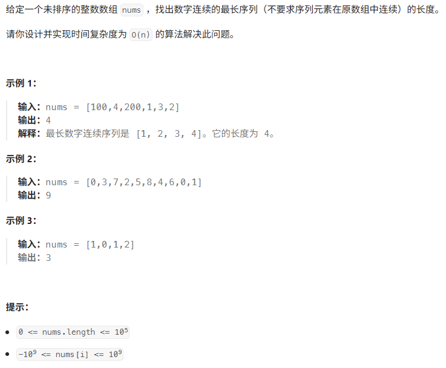

既然要找出数字连续的最长序列，那么这个序列一定是有**起始元素**的，当我们找到潜在起始元素，接下来就看它的+1、+1的+1，+1的+1的+1...是否存在于输入中，同时以 max(len1,len2) 来维护最长的长度即可。

那么如何判断一个元素是否为潜在起始元素呢？以示例1，不能将2作为起始元素，因为以1为起始元素的序列一定是比2为起始元素的序列要长的，所以**对于元素a，若a-1不存在于哈希，则a是潜在起始元素**。


# 双指针

## 283.移动零

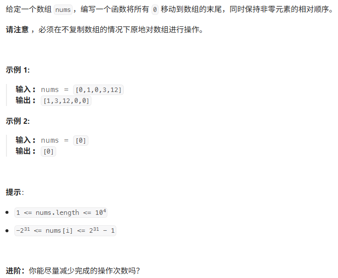

题目要求原地修改数组，满足将0全部放在末尾，而非零数字的相对顺序不变。

这里使用双指针：

指针1为待填充非零数字的索引指针，指针2为遍历中发现非零数字的索引指针

指针2从前往后遍历数组，当发现非零元素时，则与指针1交换元素，指针1初始为0（即数组开始），在与指针2交换完毕元素后，则向前移动一位。这样当指针2遍历完毕数组时，指针1及其前的元素便是保持相对顺序的非零数字。


## 11.盛水最多的容器

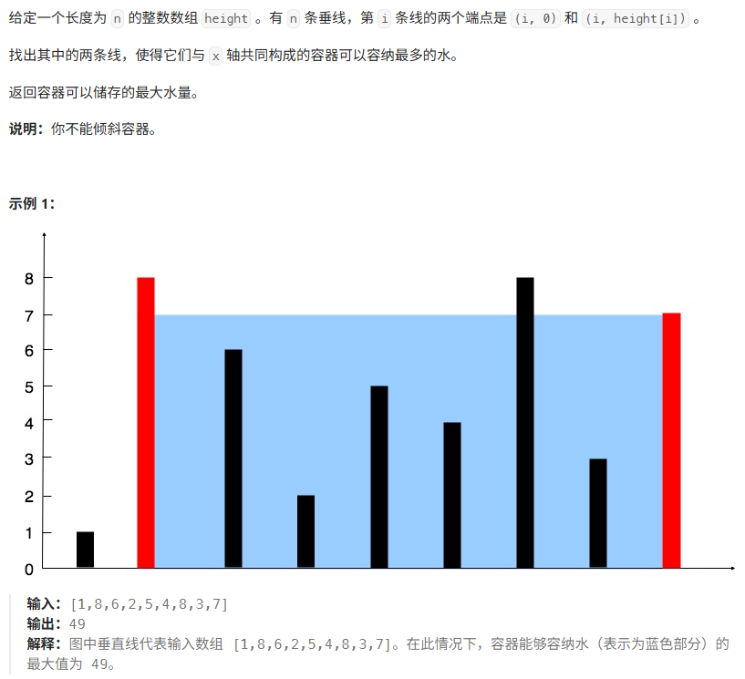

理论上可以通过**双循环**来解决，时间复杂度是 o(n2)：`for i in range(n-1): for j in range(i+1,n):`

相当于是n*n的矩形，保证i<j，则**搜索空间是矩形的一半，即不含对角线的三角形**。

此处使用**双指针来优化时间复杂度，缩小搜索空间**：

left,right分别从头和尾开始，left只能向右移动，right只能向左移动，二者不能重合。

- 假设left<right，则移动right将毫无收益（短板效应），盛水量只会更少，那么我们就将right处于当前位置（left处于任意<right的位置）的这些组合剪枝掉。
- 假设left>right，则移动left将毫无收益（短板效应），盛水量只会更少，那么就将left处于当前位置（right处于任意>left的位置）的这些组合剪枝掉。

这样就**将三角形的搜索空间缩小为线性搜索空间**，时间复杂度 o(n2) -> o(n)：

- 当left<right，则移动left，计算此时盛水量并与历史最大值比较；
- 当right<left，则移动right，计算此时盛水量并与历史最大值比较。


## 15.三数之和

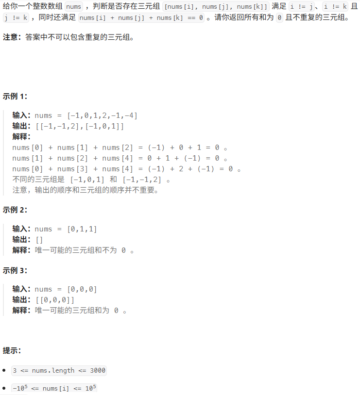

先不管重复的问题，聚焦**查全**的问题。题目要求i,j,k三者应是不同索引，则通过暴力的**三重循环**可以遍历所有可能：

`for i in range(n-2): for j in range(i+1,n-1): for k in range(j+1,n):`

上述通过要求 i<j<k，来实现在三者不相同的情况下遍历所有可能，时间复杂度为 o(n3)，显然过高，故使用**双指针来优化 j、k 的两个循环的复杂度**。

单独看 j、k的双重循环，本身时间复杂度是 o(n2)，我们先用 num.sort() 来通过 o(nlogn) 的时间复杂度进行排序。

之后让 j = i+1，k = n，其中，j只能向右移动，k只能向左移动，要求 j<k：

- 若 nums[i]+nums[j]+nums[k] == 0，则记录当前答案，j++，k--；
- 若 nums[i]+nums[j]+nums[k] > 0，则 k--，将整体和变小，看之后是否能到0；
- 若 nums[i]+nums[j]+nums[k] < 0，则 j++，将整体和变大，看之后是否能到0。

这样i的循环是 o(n)，j与k双指针是 o(n)，整体时间复杂度从 o(n3) 降到了 o(n2)。

**剪枝**：若nums[i]>0，因为nums[j]和nums[k]只会大于等于nums[i]，则三者和不可能为0，直接continue到下一个i即可。

上述可以解决将全部合理答案找到的问题，但是由于**数组中存在重复元素**，可能**导致**所找到的**三元组存在重复**，下面解决**去重**问题：

在排序后，数组的重复元素一定会相邻，我们只要**保证不让i、j、k使用重复元素**，所以在移动i、j、k的时候要检查移动后的数值是否与移动前一样，如果一样则继续移动，在具体代码里会存在两处：

- 外层i的循环，当i>0时（即 i-1 为有效索引），检查 nums[i] 与 nums[i-1] 是否相同，若相同则continue；
- 内层jk双指针，当 nums[i]+nums[j]+nums[k] == 0 时记录答案，此时j++和k--要保证移动后不能与记录答案时的 nums[j]、nums[k] 数值相同（当不记录答案，即nums[i]+nums[j]+nums[k] != 0 时，则无所谓）。


## 42.接雨水

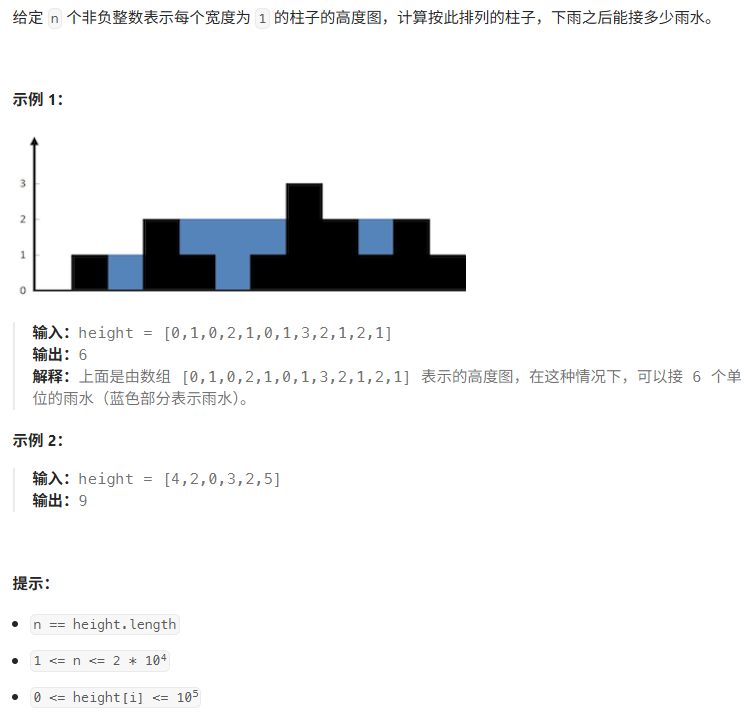

先将题目建模：对于某个柱子，其所能接雨水的量取决于它左侧的最高柱、右侧的最高柱以及自身高度，具体接水量是 **min(左侧最高，右侧最高)-自身高度**。

在计算最终接水量时，遍历每个柱子，只要知道其左右两侧最高的高度，便可以计算当前柱子的接水量。

### 方法1：前后缀数组

我们建立与 height 同长的两个数组 pre_max 和 suf_max：

- pre_max 记录**当前及其左侧范围内柱子的最大高度**
- suf_max 记录**当前及其右侧范围内柱子的最大高度**

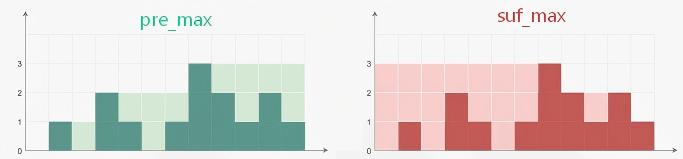

然后遍历每个柱子，按照 **min(左侧最高，右侧最高)-自身高度** 便可计算当前柱的接水量。

本方法的时间复杂度为 o(n)，空间复杂度为 o(n)。

### 方法2：双指针

双指针方法旨在将空间复杂度降低为 o(1)。

让 left=0, right = n-1，left只能向右移动，right只能向左移动，保证left<=right。此时 pre_max 和 suf_max 为数值：

- pre_max 记录**left及其左侧范围内柱子的最大高度**
- suf_max 记录**right及其右侧范围内柱子的最大高度**

此时，如果 pre_max<suf_max，则当前位置的短板就是pre_max，其接水量即 **pre_max - 当前高度**，计算完接水量后将 left 向右移动一位，同时更新pre_max。这样来理解：当前位置的左侧最大高度是pre_max，右侧最大高度大于等于suf_max（right经过的右半块的最高是suf_max，right向左直到left之间仍然可能存在柱子高度超过suf_max），则当前位置的短板一定是pre_max。若 suf_max<pre_max 同理可得。


# 滑动窗口

## 3.无重复字符的最长子串

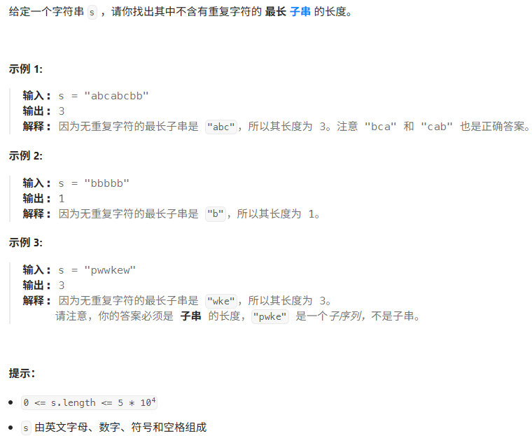

使用**滑动窗口**，left 和 right 一开始都指向s的首个元素，right 不断前进：

- 使用 dict 来记录 [left, right] 内的元素出现次数
- right前进一步，dict更新一次，同时检查新增元素在dict内是否存在次数大于1，若大于1意味着出现重复，则需要收缩窗口，即left向前移动，直到新增元素出现次数减至1
- right每次前进都维护ans，即ans=max(ans, right-left+1)


## 438.找到字符串中所有字母异位词

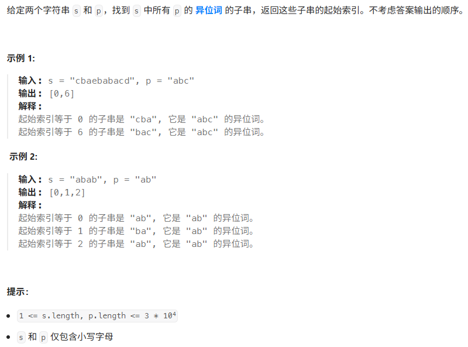

字母异位词是通过重新排列不同单词或短语的字母而形成的单词或短语，并使用所有原字母一次。

使用**滑动窗口**，窗口长度固定为 len(p)，从s的开头滑到结尾，这里注意**不要索引访问越界**。

使用 from collections import Counter，即继承dict的计数器Counter, p_counter = Counter(p)来作为比较标志，当**窗口的counter与p_counter相同**，则说明找到了满足题意的子串，记录其起始索引。


# 子串

## 560.和为K的子数组

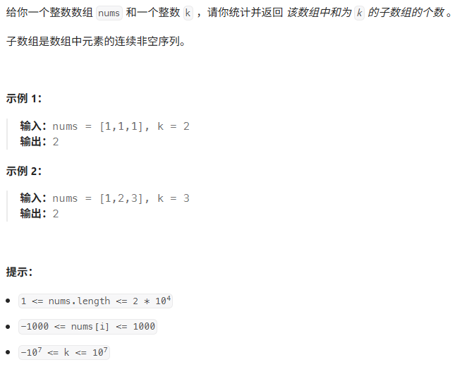

题目聚集的是nums的子数组的元素和，所以想到**前缀和技巧**。

**前缀和：**

通过 s=[0]*(len(nums)+1)，s[i+1]=s[i]+nums[i]建立的一个长度为 len(nums)+1 的数组，其中 s[i] 代表nums数组中前 i 个 元素的和。故而：

s[j]-s[i]：代表nums数组中 前j个元素和 减去 前i个元素和，即nums里 索引从 i 到 j-1 的元素和。

**转化题意：**

设0<=i<j<=len(nums)，则s[j]-s[i]可以包含所有nums的子数组的和的可能，问题就变为了：

**寻找满足s[j]-s[i]=k的ij对的数量**。

至此，可以使用 1.两数之和 的哈希 降低时间复杂度的方法解决问题：

遍历j，同时维护Counter来记录已经出现过的数，ans+=counter[target]，而target=s[j]-k。


## 239.滑动窗口最大值

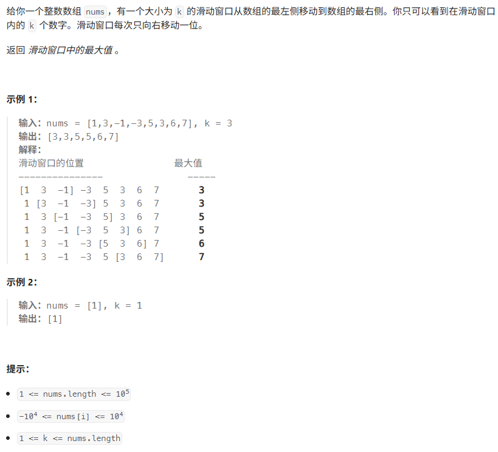

遍历滑动窗口你肯定会，但是在窗口内找最大值，若是用max(数组)，则时间复杂度会超标，所以重点在于**以o(1)的方式来维护窗口内的最大值**。

这里使用**collections**里的**deque**，即**队列**，它可以**以o(1)的时间复杂度在头尾增删元素**。
deque维护窗口内的数据中的**有效数据（这里是nums的索引）**，有效是指对找最大值有用的数据。涉及3个过程：

- **增加数据**：窗口向前滑动，会带来新的元素，该元素必然要进入deque（为什么必然？因为它有可能是后续窗口的最大值）。那么在进入时可以对deque内已经存在的元素做一道过滤（去掉无效数据），如果deque末尾元素比新元素小（或相等），那么这个末尾元素在新元素到来后就没有存在的意义了，需要deque.pop()，直到deque末尾的元素比新元素大，才停止过滤，加入新元素；
  **tip：这样维护的deque的首元素就是最大值，也就是每个窗口的最大值答案**
- 删除数据：窗口向前滑动，那么有元素会被滑出去，则需要从deque内删除它。这里要分两种情况，被滑出去的数据可能是无效数据，在被滑出之前已经被pop掉了；另一种情况就是被滑出去的数据是有效数据，此时popleft，即删掉deque内的首个元素（为什么是删首位元素？因为deque在构建的时候，其顺序就是nums里从左到右的，只不过没有无效数据，相当于是窗口内的保持原nums相对顺序的有效数据）。
  这里具体的，就是**根据当前窗口右端所在索引和deque首元素（即此时窗口有效数据里的最大值的索引）来计算窗口长度，如果超出规定，则删首元素。**
- **记录答案**：当窗口左端是nums内的合法索引时，则记录deque的首元素索引对应数值。


## 76.最小覆盖子串

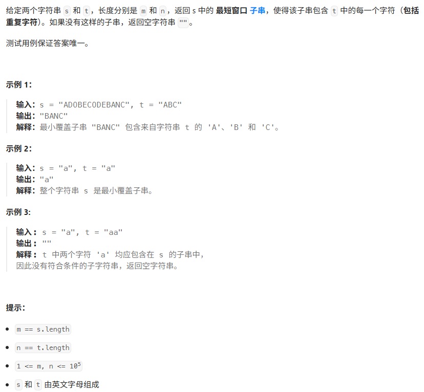

示例3提示，s的长度如果小于t的长度，则直接返回空字符串。

> [!NOTE]
>
> **如何判断两个字符串a是否包含字符串b呢？**
>
> 这里使用**collections里的Counter**，对a和b内元素分别计数，遍历b的计数器，要求b的每个元素的数量必须小于等于a里对应元素的数量，此时a包含b。

对于t字符串，在最开始便可以通过Counter来计数，而s字符串，则可以通过滑动窗口来获取其子串的计数：

left与right均初始化在s的开始，right不断前进，[left,right]子串若包含了t，则left不断前进，直到不再包含（在left前进期间，一直更新最短子串）。


# 普通数组

## 53.最大子数组和

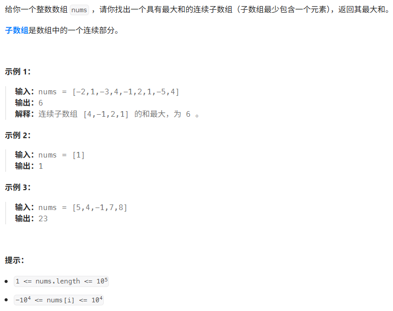

子数组和，则第一时间联想到**前缀和**，

```python
s=[0]*(len(nums)+1)
for i in range(len(nums)): 	s[i+1]=s[i]+nums[i]
```

这样s[i]代表nums前i个元素之和，s[j]-s[i] (i<j)则可以代表nums里所有子数组之和的可能值。

这样，问题就转化为了：在数组s里，找出s[j]-s[i]的最大值。

因为i<j，不如这样看待问题：遍历j从1到结束，维护j左侧的最小值（初始最小值就是s[0]），每次j前进时就计算s[j]-min，来和以前计算的ans来取max，这样最后ans就是答案。


## 56.合并区间

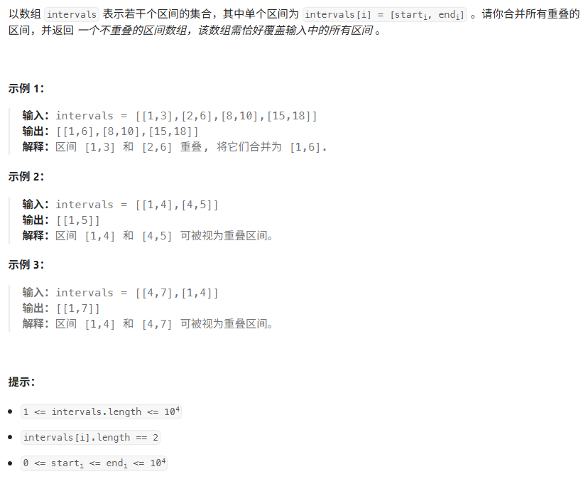

需要合并的区间肯定存在重叠，通过intervals.sort()来排序，这样需要合并的若干区间肯定是连续存在于intervals里。

维护一个结果数组 ans，把intervals的首个元素append进ans,开始遍历intervals的剩余元素：

- 如果新元素的left大于ans最后一个元素的right，说明新元素区间与上一个记录不重叠，则ans的最后一个元素合并完成，将新元素加入ans（后续可能合并）；
- 如果新元素的left小于等于ans最后一个元素的right，说明新元素需要与ans的最后一个元素合并，更新ans最后一个元素的right为max(ans最后一个元素的right，新元素的right)。

**tip：ans的最后一个元素一直处于待合并状态。**


## 189.轮转数组

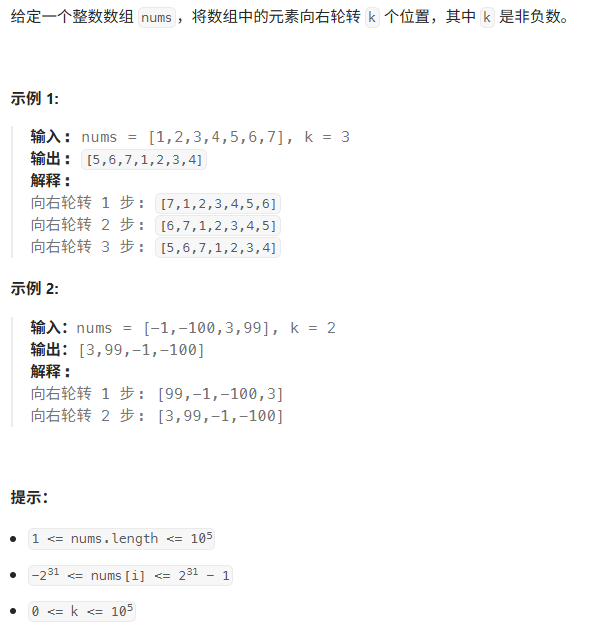

要求空间复杂度为o(1)的**原地算法**解决问题。记住套路即可，以 nums = [1 2 3 4 5 6 7] 为例：

- 先将数组整体反转，[7 6 5 4 3 2 1]
- 再反转前k个元素，[**5 6 7** 4 3 2 1]
- 再反转剩余元素，[5 6 7 **1 2 3 4**]

**另外需注意将k去周期化（周期就是nums的长度）**

> [!NOTE]
>
> **python内置的数组反转函数**
>
> - `nums.reverse()` 方法，**原地反转列表**
> - `reversed(nums)`方法，**返回反转后的结果列表**


## 238.除了自身以外数组的乘积

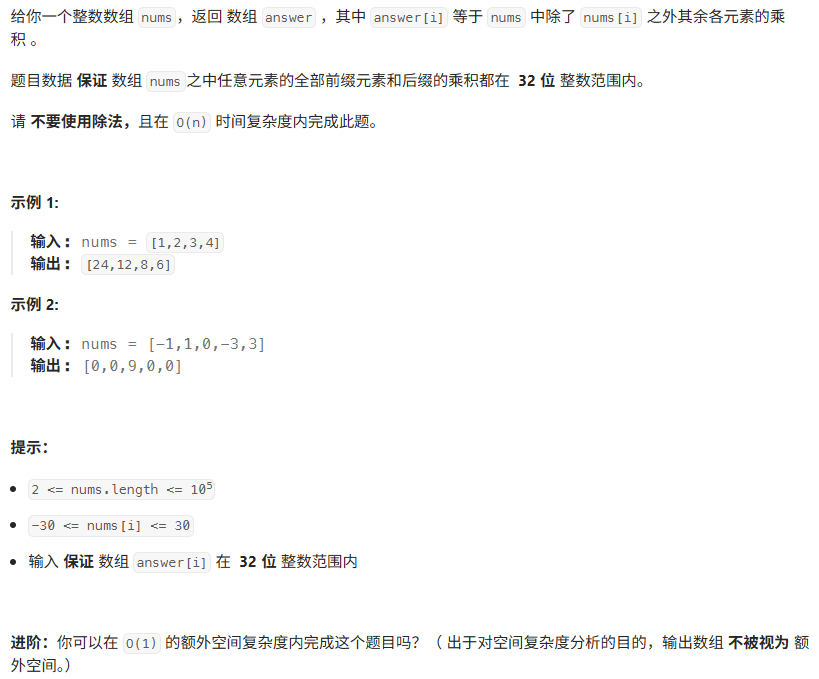

受**数组前缀和**的启发，此处可以建立两个数组，分别是**前缀积**和**后缀积**：

```python
pre = [1]*n # 从前往后遍历nums，让pre[i]代表nums[i]左侧元素的乘积
suf = [1]*n # 从后往前遍历nums，让suf[i]代表nums[i]右侧元素的乘积
ans = [pre[i]*suf[i] for i in range(n)] # 这便是结果数组
```

**优化空间复杂度为o(1)，即除了return的数组外不用额外空间：**

```python
suf = [1]*n # 从后往前遍历nums，让suf[i]代表nums[i]右侧元素的乘积
# 建立完后缀积后，从头开始遍历nums，将答案记在suf里
pre = 1
for i in range(n):
    suf[i]=pre*suf[i]
    pre = pre*nums[i]
return suf
```


## 41.缺失的第一个正数

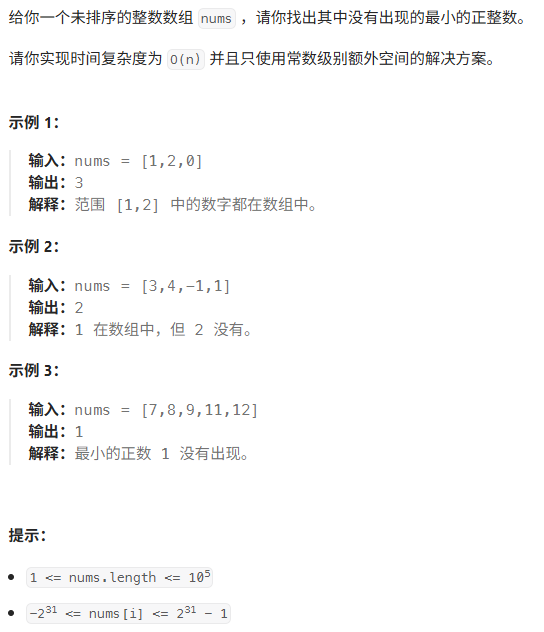

只能用**o(1)的空间复杂度**，则需要**原地修改**数组，调整后的理想情况是：

```python
# nums的长度为n，其中nums[i]=i+1，即 索引i 处存放的 数字是i+1：
nums = [1,2,3,4,5,6,7]
index = [0,1,2,3,4,5,6]
```

按照这样排列后，**缺失的第一个正数就是n+1**

但情况绝不会如此简单：

**① 存在不在1-n之间的数字** ---> **不需安置它，它本身就没有自己的位置，最后分到哪就是哪**

```python
# 原始数组
nums = [3,4,-1,1]
# 往理想情况排列
# 3应该存放在索引3-1=2处，所以将索引0与索引2的元素交换
nums = [-1,4,3,1] 
# -1不在范围内，不管
# 下一个元素是4,4应该存放在索引4-1=3处，所以交换索引1与索引3的元素
nums = [-1,1,3,4]
# 此时在索引1的元素是1，它应该存放在索引1-1=0处，所以交换索引1与索引0的元素
nums = [1,-1,3,4]
# 此时所有元素已经安置好
# 缺失的第一个正数就是第一个 nums[i]!=i+1 的 i+1，这里就是2
```

**②数组内有重复元素** ---> **若它应该放的位置上已经有正确的数字，则不需要管它**

```python
# 原始数组
nums = [1,1,2,3]
# 第一个元素1应该放在索引1-1=0处，正确
# 第二个元素1应该放在索引1-1=0处，查看索引0发现已经放了正确的元素1，则此时第二个元素1暂不管
# 第三个元素2应该放在索引2-1=1处，故交换索引2与索引1的元素
nums = [1,2,1,3]
# 同理，不处理此时在索引2上的元素1
# 第四个元素3应该放在索引3-1=2处，故交换索引3与索引2的元素
nums = [1,2,3,1]
# 同样的，缺失的第一个正数就是第一个 nums[i]!=i+1 的 i+1, 这里是4
```

故**最终的处理逻辑**是：

遍历nums，给**nums[i]一个合理的去处**：

- 如果nums[i]不是1-n之间的数，则不需要管它

- 如果nums[i]是1-n之间的数，则它应该存放在索引nums[i]-1处：

  - 如果nums[i]-1就是i，则说明nums[i]放对了位置，不需要管它

  - 如果nums[i]-1不是i，说明nums[i]放错了位置，需要进一步看：

    - 若索引nums[i]-1处现有元素就是nums[i] (重复元素)，则不需要管nums[i]

    - 若索引nums[i]-1处现有元素不是nums[i] ，则交换索引为i和索引为nums[i]-1的元素

      这里**注意：先记录下需要交换的两个索引，避免因nums[i]改变而导致索引错误**

总结下来，需要交换索引的情况发生在：

`0=<nums[i]<=n and nums[nums[i]-1]!=nums[i]`

**所以唯一需要交换元素的情况是：**

nums[i]在1-n之间 **and** nums[i]-1!=i **and** nums[nums[i]-1]!=nums[i] 

( nums[i]-1!=i **and** nums[nums[i]-1]!=nums[i]  可以合并为 nums[nums[i]-1]!=nums[i] )


# 矩阵

## 73.矩阵置零

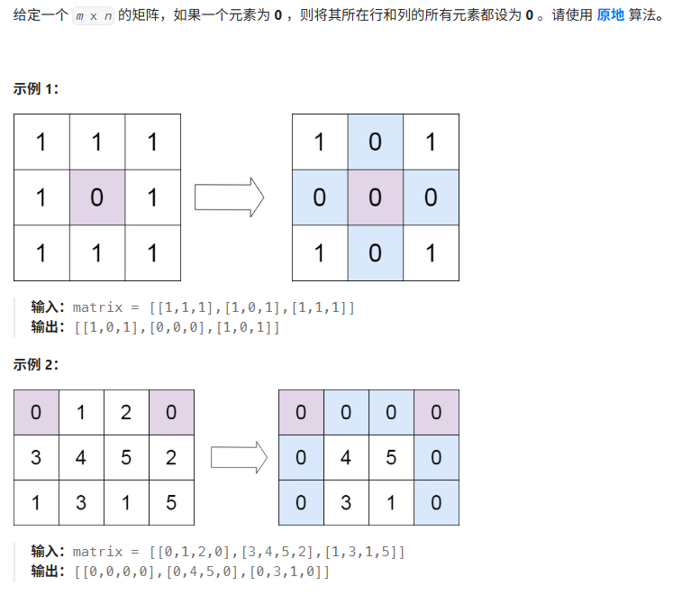

已知矩阵行数为m，列数为n，创建两个数组rows和cols：

- rows有m个元素，rows[i]表示矩阵第i行是否需要置零；
- cols有n个元素，cols[j]表示矩阵第j列是否需要置零。

遍历矩阵的每个元素，遇到0，则把该元素所在行标记（在rows中），所在列标记（在cols中）。

第二次遍历矩阵，把在有标记的行或列的元素置零。

**上述做法的空间复杂度是o(m+n)，下面将其优化到o(1)**，即不创建额外的rows和cols：

- 首先，看矩阵的第一行和第一列是否有零元素（代表其是否需要置零）；
- 接着，遍历矩阵每个元素，遇到0则标记该元素所在行和列，标记信息存放在矩阵的第一行和第一列；
- 然后，遍历矩阵（除第一行和第一列），把有标记的行或列的元素置零；
- 最后，根据第一行是否需要置零来处置第一行，第一列同理。


## 54.螺旋矩阵

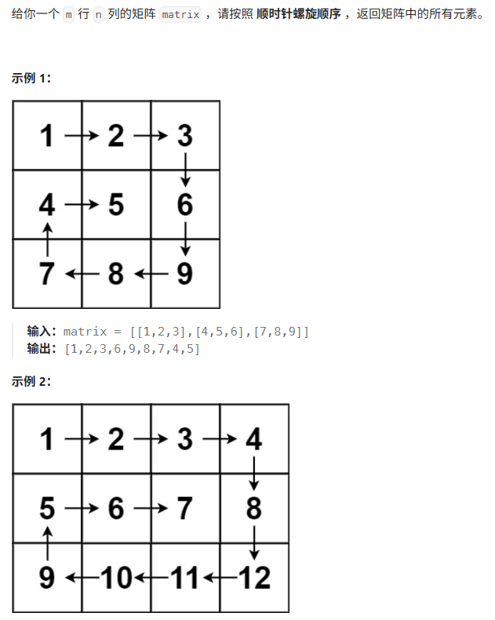

**顺时针螺旋**的前进方向是：**右-->下-->左-->上**

在矩阵情景下，前进方向可以理解为：**DIR = ((0,1), (1,0), (0,-1), (-1,0))**，假设当前是(i, j)：

- 向右走，相当于(i, j)+(0, 1)
- 向下走，相当于(i, j)+(1, 0)
- 向左走，相当于(i, j)+(0, -1)
- 向上走，相当于(i, j)+(-1, 0)

 **方向改变的时机**：碰到**矩阵边界** or 碰到**已经记录过的元素**

> [!NOTE]
>
> 边界很清晰，**如何看是否会碰到已经记录过的元素呢？**
>
> 将取用过的数据设为**None**，通过判断是否为None即可知道

我们**循环*mn*次（因为一共有*mn*个元素待提取）**，i=j=0开始，初始方向向右。

先存放matrix [i] [j]，再调整ij到下一位置，这里是要注意的点：

我们先假设方向不变，得到方向不变情况下的下一位置 x,y，判断xy是否超边界或已被记录？

若超边界或已被记录，则需改变方向，对于**DIR**来说，就是索引+1，同时为了防止索引越界，则用模：i=(i+1)%4


## 48.旋转图像

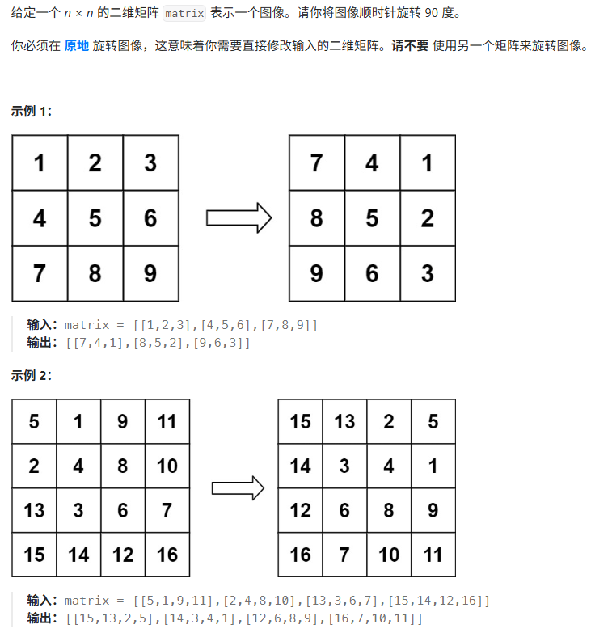

直接记住：**顺时针旋转90°，则先将矩阵转置，再对矩阵每行用，row.reverse()原地逆转**

可以推导一下：

```python
1 2 3        1 4 7				  7 4 1
4 5 6 -->转置 2 5 8 -->每行reverse  8 5 2
7 8 9		 3 6 9				  9 6 3
```

**其他旋转方向或角度则可以套用顺时针旋转90°**：

- 顺时针旋转180° ---> 顺时针旋转90°，再顺时针旋转90°
- 顺时针旋转270°（逆时针旋转90°）---> 顺时针旋转90° 3次

也可以记住：**逆时针旋转90°，先将矩阵转置，再对矩阵每列进行倒置**

推导一下：

```python
1 2 3        1 4 7				  3 6 9
4 5 6 -->转置 2 5 8 -->每列reverse  2 5 8
7 8 9		 3 6 9				  1 4 7
```


## 240.搜索二维矩阵2

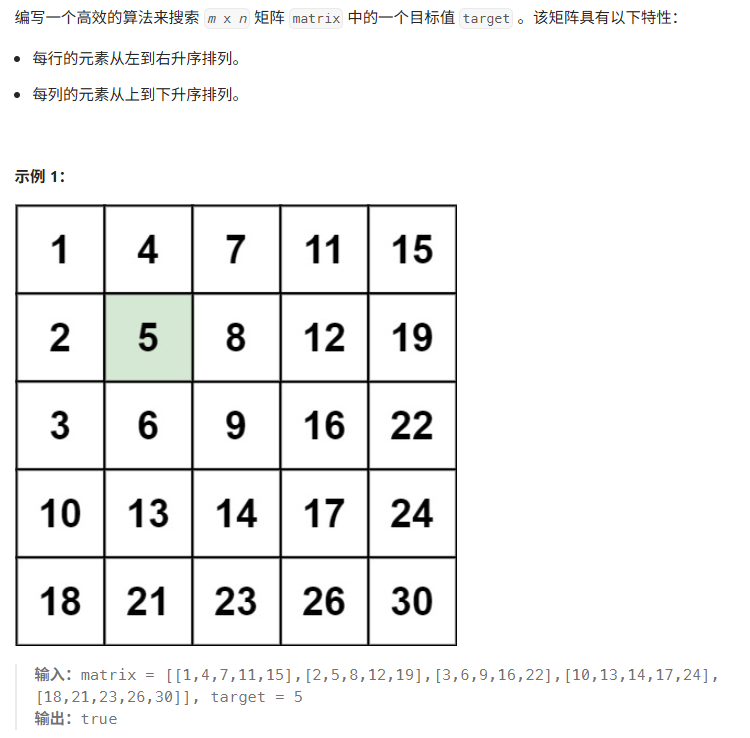

矩阵内的元素，越右越小，越下越小。利用这个特性来优化时间复杂度：

- 聚焦**右上角元素**，它是**所在行的最大值**，**所在列的最小值**；
- 若该元素**等于**target，则**找到**；
- 若该元素**大于**target，则**排除所在列**，因为该列的最小值都要比target大；
- 若该元素**小于**target，则**排除所在行**，因为该行的最大值都要比target小。


# 链表

## 160.相交链表

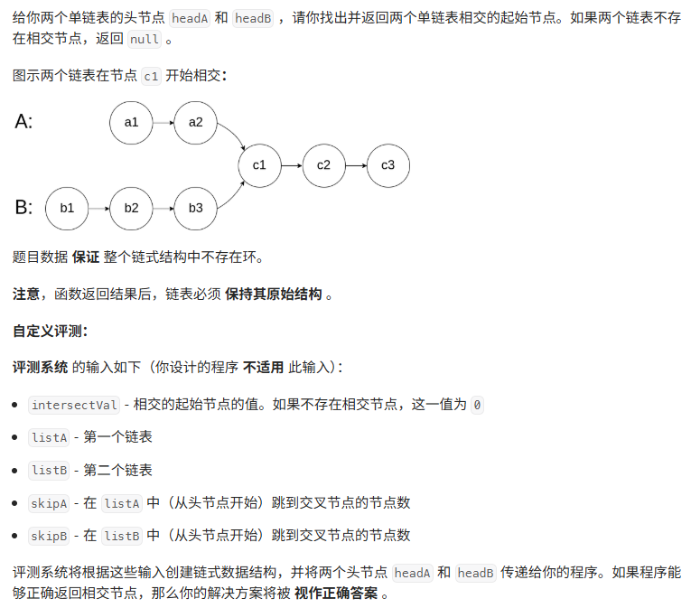

按照**指针1从”A+B“遍历**，**指针2从”B+A“遍历**，当两个**指针重合**时，找到相交节点。

为了兼容非相交情况，我们将**A和B各自末尾的None**也作为需要遍历的元素。

```python
q1 = headA
q2 = headB
while q1!=q2:
    q1=q1.next if q1 else headB
    q2=q2.next if q2 else headA
return q1
```


## 206.反转链表


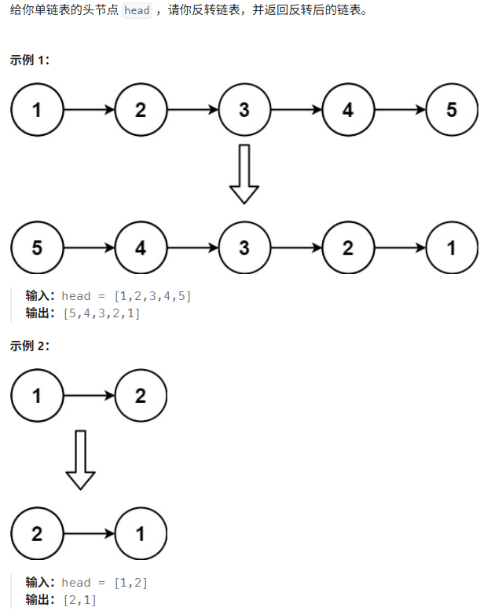

直接看代码：

```python
pre = None
cur = head
while cur:
    nxt = cur.next
    cur.next = pre
    pre = cur
    cur = nxt
return head
```


## 234.回文链表

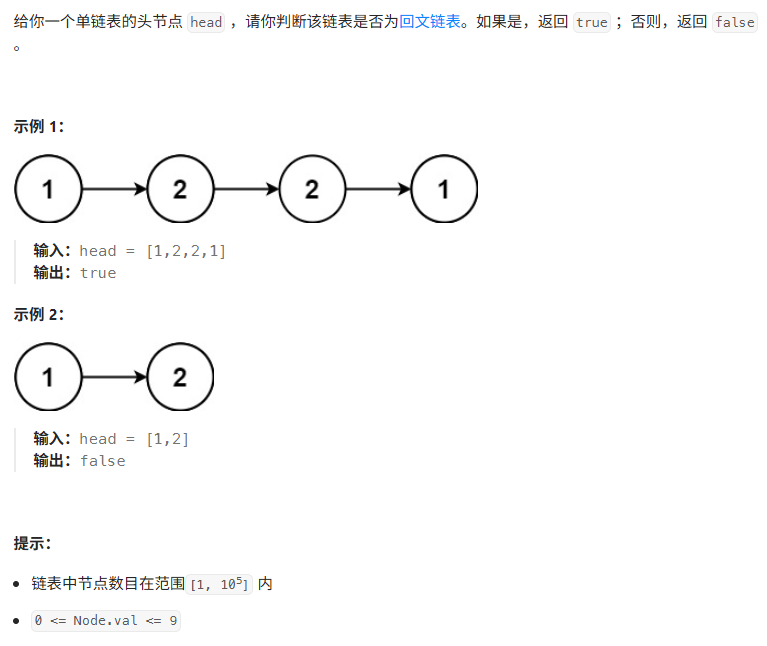

这里涉及两个子题：**找到链表的中间节点，反转链表**（206）。

找中间节点用**快慢指针**：

```python
# 对于12345这样的奇数长度，则中间节点是3
# 对于1234这样的偶数长度，则中间节点是3（中间偏右）
slow = fast = head
while fast and fast.next: # 循环条件这样理解，fast要移动两步，所以既要保证fast有效，也要保证fast.next也有效
    slow = slow.next
    fast = fast.next.next
return slow
```

我们**先找到链表中间节点mid，再把mid为头的链表反转**；

之后从**head**和**reverse(mid)**开始，一个个比较值是否相同。


## 141.环形链表

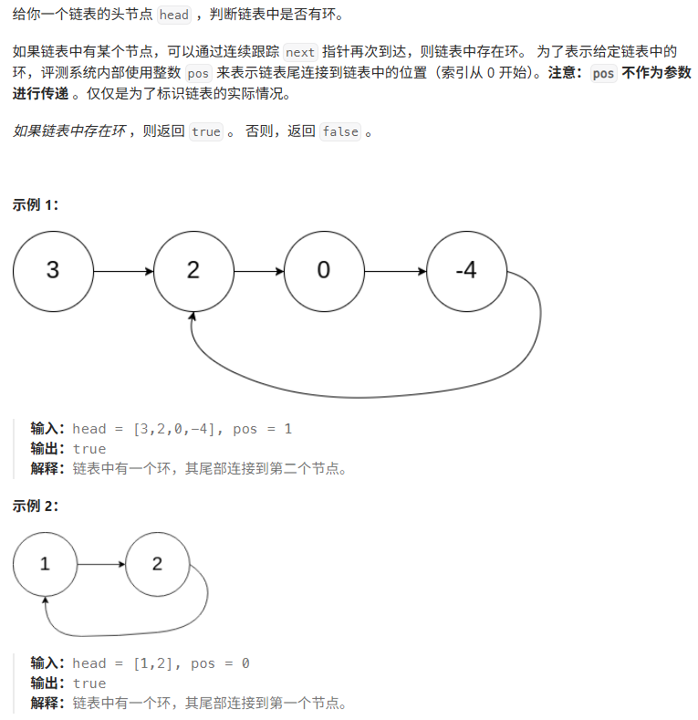

理解为**追及问题**，我们让**slow和fast两个指针都从head出发，slow一次走一步，fast一次走两步**，如果有环则它们一定会相遇，此时的步数差就是环的长度。


## 142.环形链表2

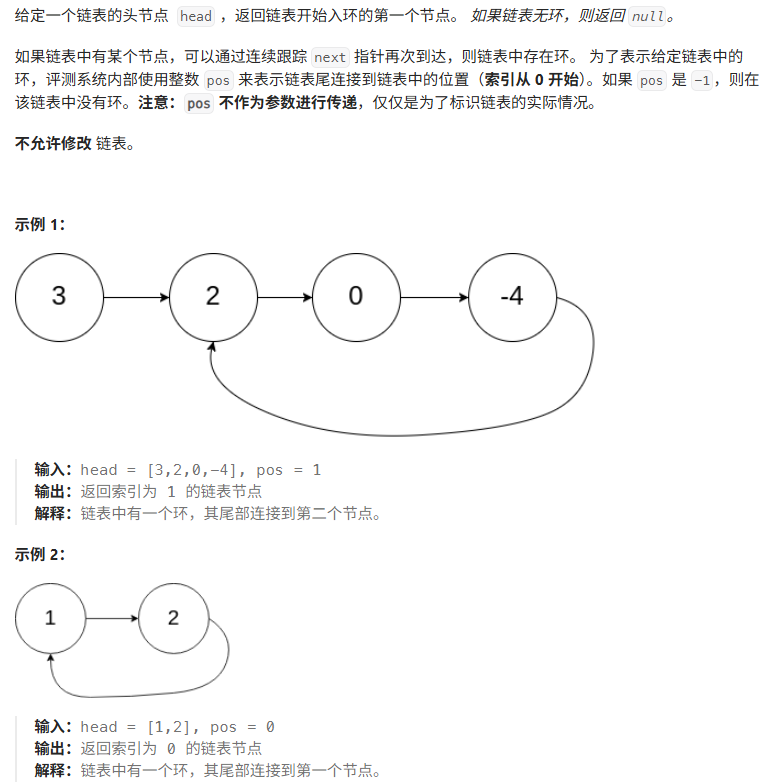

这题要求**有环则返回环入口节点，无环则返回None**，相比上一题只需要**添加“发现环后，确认环入口位置”的逻辑：**

**在发现环后，将slow或fast其一重新放回head，然后二者同速前进，再次相遇时就是在环节点。**

证明一下：

设head到环入口长度a，环入口到初次相遇点长度b，初次相遇点继续走到环入口长度c，

则slow走过的长度是a+b，fast走过的长度是a+n(b+c)+b，

fast走过的长度是slow的两倍：2(a+b)=a+n(b+c)+b

整理得：a = (n-1)(b+c)+c，即可以知道**head到环入口长度**等于**初次相遇点继续走到环入口长度**+环长*(n-1)


## 21.合并两个有序链表

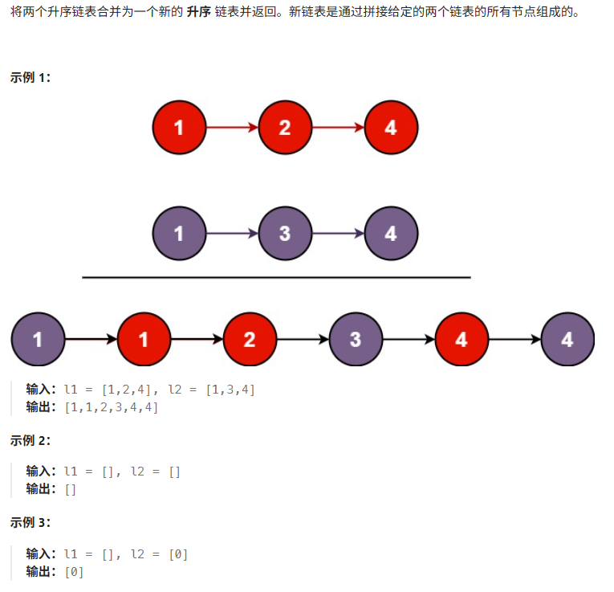

创建 **虚拟头结点 dummy**，cur=dummy，来不断填充 cur，最终 **返回** **dummy.next**。

- p1和p2分别指向l1和l2，如果二者都存在，则将小的那个加在 cur 后面；
- 如果有一个不存在了，则将另一个接着 cur 后面。


## 2.两数相加

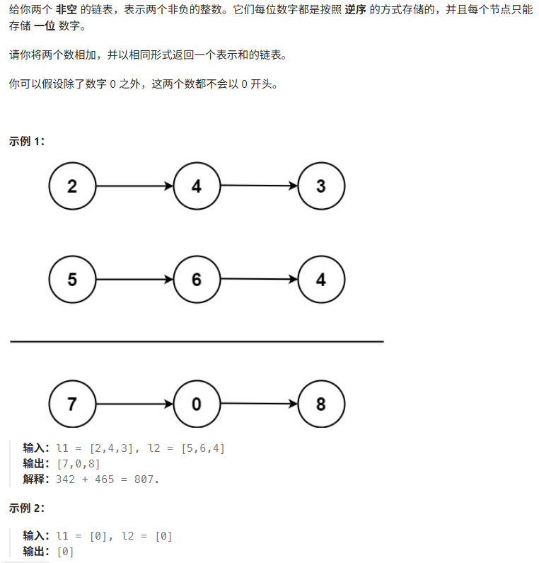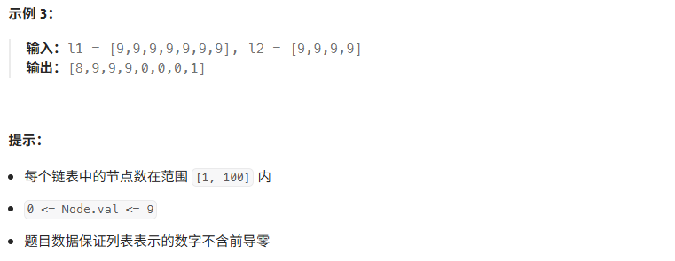

创建一个 **额外数字 extra（初始为0）** 来存储每次下一个位数上数字相加时应该额外加的进位。

两个指针分别指向l1和l2，其一存在则可以继续：

- 如果二者都有，则可以把二者值和extra都加起来；
- 只有一个有，则用其值和extra加起来；

把上面**加的和s**，**存储入新链表里** **s%10**，**更新 extra 为** **s//10**。

最后，当l1和l2都遍历完了，检查extra，如果非零则新建节点存储extra。


## 19.删除链表的倒数第N个结点

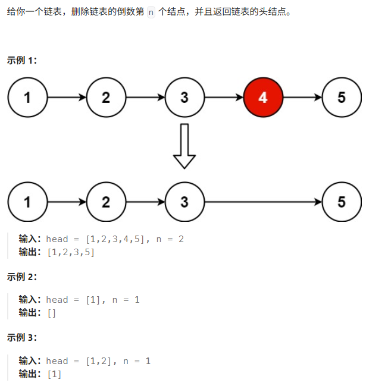

因为有可能删除首节点（即需要动原来的head），所以这里要用 **虚拟头节点 dummy**。

分析问题，**如果要删除倒数第n个节点，则需要找到倒数第n+1个节点：**

- **倒数第n+1个节点走至None，需要走n+1步；**
- 让slow和fast初始化在head，fast先往前走n+1步；
- 之后二者同步走，当fast到None时，slow就到了倒数第n+1个节点；
- 让 **slow.next = slow.next.next** 即可。

最后 **返回 dummy.next**。


## 24.两两交换链表中的节点

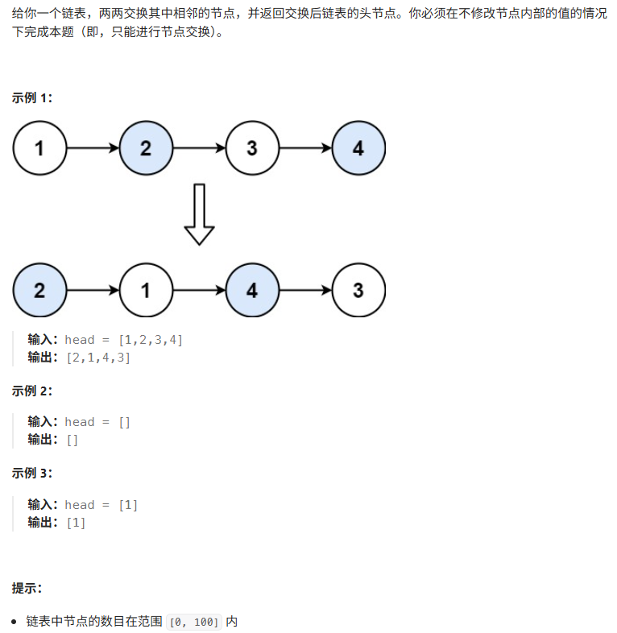

示例2和示例3提示了我们，如果链表长度为0或1，则直接返回原链表。

两两交换，肯定涉及head，故引入dummy(next = head)。

cur初始化为head，相当于若cur和cur.next都存在时，开始两两交换。

**要注意的是，在改变一个指针next的时候，要考虑一下这个指针原来的next的信息我是否需要保留，比如示例1中2->3，当把2转去指向1时，要先把3的节点保留住，否则1->2反转完就无法与原来的链表连接上了。**


## 92.反转链表2

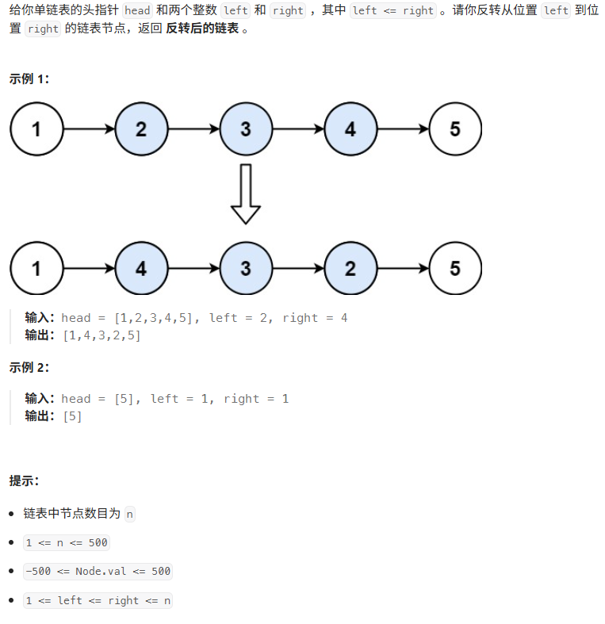

题目要求在链表内的某一段范围反转链表，首先可能波及head（left可以为1），所以引入虚拟头节点dummy。

如果单独让反转“2-->3-->4-->None”，你肯定会，结果就是“4-->3-->2-->None”。现在它们作为链表内部的一段，需要拼接，即让1与反转后的链表头接上，反转后的链表尾部与5接上。我们可以知道的是，反转链表最后的pre是反转后的链表头（4），cur则是原链表里4之后的一个节点（5），所以我们是知道这段需要反转链表后面的节点的，即cur。所以还需要去找到反转链表的前一个节点（1），这里通过从dummy向前移动left-1步可以找到p（1）。

这样就明了了，当把内部链表反转完毕后，让 p.next.next = cur，p.next = pre。


## 25.K个一组翻转链表

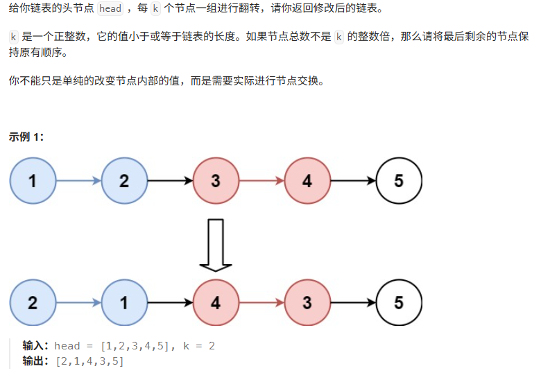

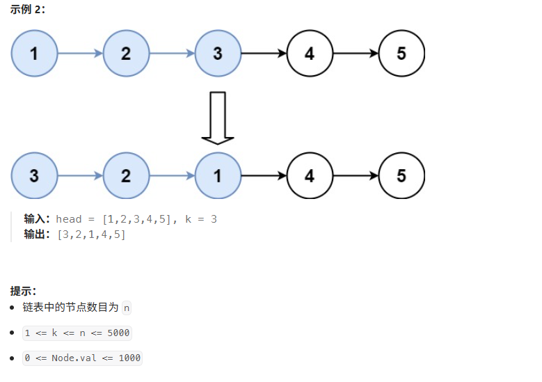

首先统计链表节点数目n，然后通过while n>=k: n-=k的方式来控制反转次数。

可以看到head可能被波及，所以引入**虚拟头节点 dummy(next = head)**。

每次反转如92.一样，要将需要反转的链表的前一个节点找到，记录其为p，反转结束后，p.next.next = cur，p.next = pre。**要注意的是，需要更新p，让p为下一次反转的前一个节点！**（先记录 pxt = p.next，最后 p = pnxt，防止因改变p的指向而丢失信息）。


## 138.随机链表的复制

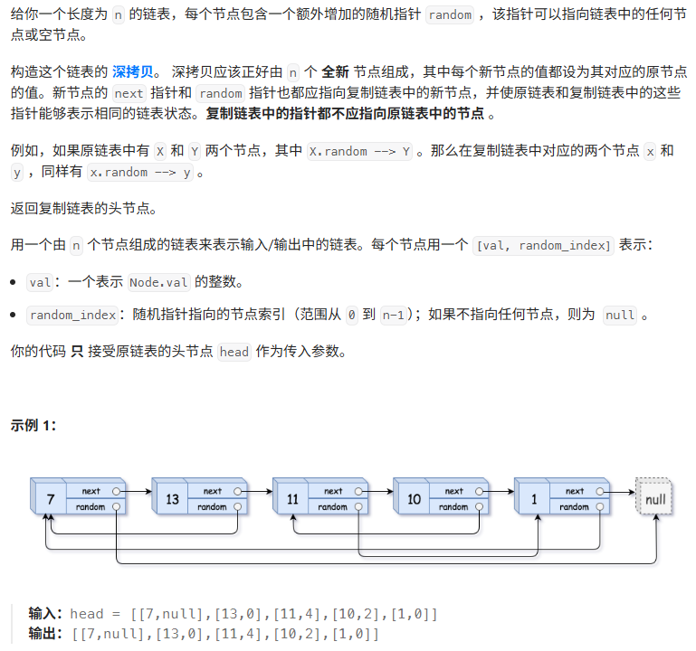

总体思想：通过将新链表与旧链表**交错**，再提取出新链表

分为三步：**复制原链表基础信息，添加新链表的random信息，提取新链表**

- 复制原链表基础信息：遍历原链表，在cur后面加上其复制体（只用val和next），这样原链表是变为之前长度的2倍了
  1-->2-->3-->4-->5 变为了 1-->1'-->2-->2'-->3-->3'-->4-->4'-->5-->5'
- 添加新链表的random信息：同样遍历原链表，假设cur为原链表某节点，如果cur.random存在，则**cur.next.random = cur.random.next**，即完成了其复制链表的random指向
- 提取新链表，建立dummy，把新链表的节点串起来即可

此处也可以在串起新链表的同时，把原链表恢复原样


## 148.排序链表

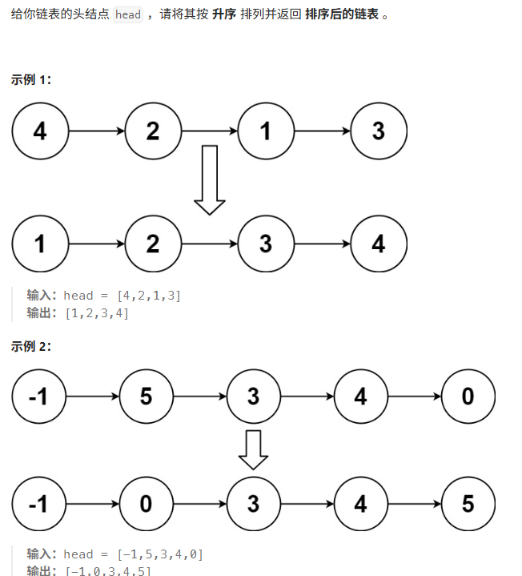

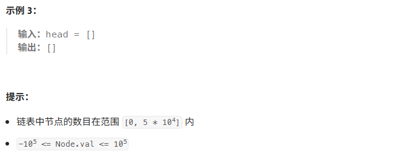

思路：

- 先找到链表中点（快慢指针），让中点前一个点的next为None，即把原链表分为两个链表；
- 对于这两个链表，分别调用本身，实现各自的升序排序；
- 最后就是合并两个升序链表。

其中，边界条件是，若链表长度小于等于1，则本身就是排序结果。


## 23.合并K个升序链表


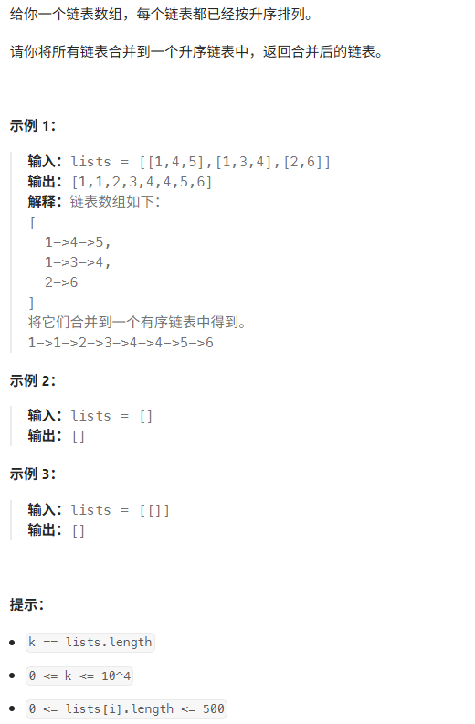

### 方法1：重定义链表的小于号+最小二叉堆

用匿名函数定义链表比大小：

```python
ListNode.__lt__ = lambda a,b: a.val<b.val
```

堆的用法：

```python
import heapq

h = []
# 添加元素 o(logn)
heappush(h，x) # 把x入堆，x是有__lt__方法的类型
# 弹出最小值（堆顶） o(logn)
minval = heappop(h) # 弹出最小
```

整体思路：

- 先遍历每一个链表，若非空则加入到堆；
- 初始化dummy，并用p=dummy;
- 弹出堆顶最小节点，p.next=该最小节点；
- 若该节点的next存在，则也加入到堆中；
- 当堆为空，则结束。

### 方法2：分而治之

- 统计总链表数；
- 前一半链表进行升序合并（调用自身函数）；
- 后一半链表进行升序合并（调用自身函数）；
- 合并两个升序链表得到最终结果。

边界条件：链表数小于等于1，则自身即为合并结果。


## 146.LRU缓存

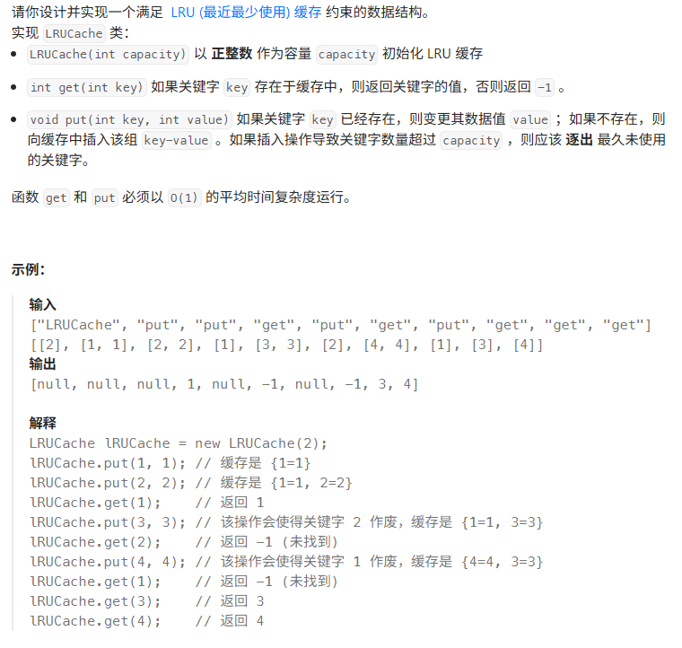

涉及的数据结构：

- 双向链表，加上dummy可以实现全连接（既可以看到链表的首元素，也可以看到链表的末尾元素）；
- 链表节点，需要有双向指针，存储的key和value；
- 字典dict，关键字key为键，存储的值为链表节点。

思想：

- 因为当容量达到设置值时，需要逐出最久未使用的元素，所以我们一旦使用了某元素（put/get），则需要把它调整到链表头(dummy后面)；
- 因为要以o(1)空间复杂度，所以引入字典dict来实现o(1)的查找；
- 超容量只会发生在put里，加入了新的，旧的才可能多余，所以在put之后要检查容量。

```python
class Node:
    def __init__(self, key=0, val=0, prev = None, next0 = None):
        self.key = key
        self.val = val
        self.prev = prev
        self.next = next0


class LRUCache:
    def __init__(self, capacity: int):
        self.capacity = capacity
        self.dummy = Node()
        self.dummy.prev = self.dummy
        self.dummy.next = self.dummy
        self.key2node = dict()

    # 获取key对应的节点，若没有则返回None；并将该节点移动链表头部
    def get_node(self, key: int) -> Optional[Node]:
        if key not in self.key2node:
            return None
        node = self.key2node[key]
        self.remove(node)
        self.push_front(node)
        return node
    
    def get(self, key: int) -> int:
        node = self.get_node(key)
        return node.val if node else -1

    def put(self, key: int, value: int) -> None:
        if key in self.key2node:
            node = self.get_node(key) # 此处在get_node已将使用过的置顶
            node.val = value
            return
        # 新增时，字典和链表要同步增加
        node = Node(key, value)
        self.key2node[key] = node
        self.push_front(node)
        if len(self.key2node) > self.capacity:
            denode = self.dummy.prev
            # 删除时，字典和链表要同步删除
            del self.key2node[denode.key]
            self.remove(denode)

    # 删除节点x 
    def remove(self, x: Node) -> None:
        x.prev.next = x.next
        x.next.prev = x.prev

    # 在链表头添加节点x
    def push_front(self, x: Node) -> None:
        x.prev = self.dummy
        x.next = self.dummy.next
        x.prev.next = x
        x.next.prev = x


# Your LRUCache object will be instantiated and called as such:
# obj = LRUCache(capacity)
# param_1 = obj.get(key)
# obj.put(key,value)
```


## 94.二叉树的中序遍历

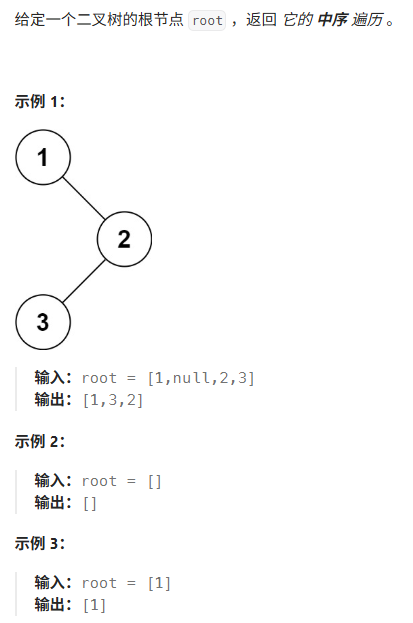

直接默写：

```python
class Solution:
    def inorderTraversal(self, root: Optional[TreeNode]) -> List[int]:
        ans = []
        def traverse(root: Optional[TreeNode]) -> None:
            if not root:
                return 
            traverse(root.left)
            nonlocal ans
            ans.append(root.val)
            traverse(root.right)
        
        traverse(root)
        return ans
```


## 104.二叉树的最大深度

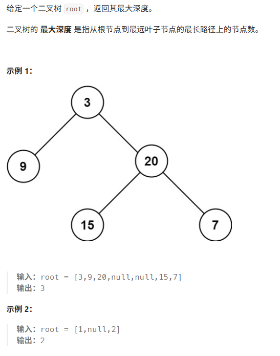

### 方法1：递归

```python
# Definition for a binary tree node.
# class TreeNode:
#     def __init__(self, val=0, left=None, right=None):
#         self.val = val
#         self.left = left
#         self.right = right
class Solution:
    def maxDepth(self, root: Optional[TreeNode]) -> int:
        if not root:
            return 0
        if root.left is root.right:
            return 1
        
        return 1 + max(self.maxDepth(root.left), self.maxDepth(root.right))
```

### 方法2：迭代

```python
# Definition for a binary tree node.
# class TreeNode:
#     def __init__(self, val=0, left=None, right=None):
#         self.val = val
#         self.left = left
#         self.right = right
class Solution:
    def maxDepth(self, root: Optional[TreeNode]) -> int:
        
        def traverse(root: Optional[TreeNode], depth: int) -> None:
            if not root:
                return
            depth+=1
            nonlocal ans
            ans = max(ans, depth)
            traverse(root.left, depth)
            traverse(root.right, depth)

        ans = 0
        traverse(root, 0)
        return ans
```


## 226.翻转二叉树

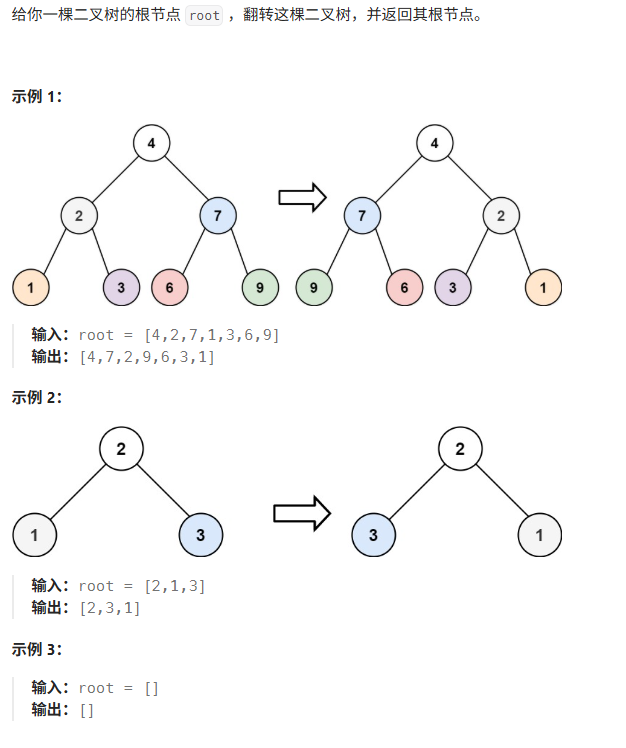

递归

```python
# Definition for a binary tree node.
# class TreeNode:
#     def __init__(self, val=0, left=None, right=None):
#         self.val = val
#         self.left = left
#         self.right = right
class Solution:
    def invertTree(self, root: Optional[TreeNode]) -> Optional[TreeNode]:
        if not root:
            return None
        
        left = self.invertTree(root.right)
        right = self.invertTree(root.left)

        root.left = left
        root.right = right

        return root
```


## 101.对称二叉树

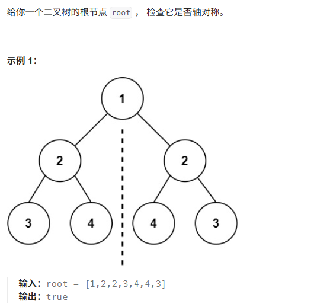

新建辅助函数，判断传入的两棵树是否对称相等。

```python
# Definition for a binary tree node.
# class TreeNode:
#     def __init__(self, val=0, left=None, right=None):
#         self.val = val
#         self.left = left
#         self.right = right
class Solution:
    def isSymmetric1(self, root1: Optional[TreeNode], root2: Optional[TreeNode]) -> bool:
        if root1 is root2:
            return True
        if not root1 or not root2:
            return False
        
        return root1.val == root2.val and self.isSymmetric1(root1.left,root2.right) and self.isSymmetric1(root1.right, root2.left)


    def isSymmetric(self, root: Optional[TreeNode]) -> bool:
        
        return self.isSymmetric1(root.left,root.right)
```


## 543.二叉树的直径

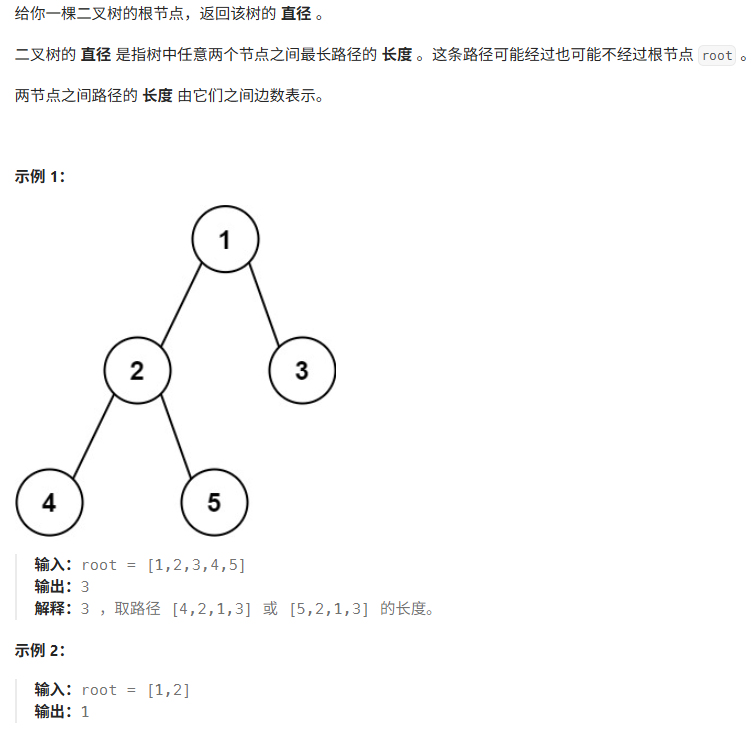

凡是**直径，肯定有一个拐点**，即从某节点的左子树连到它的右子树，那么这个某节点就是**关键**。

我们希望**维护ans**，然后**遍历每个节点**，让**每个节点作为拐点的直径长度来和ans取max**，这样最终的ans就是答案。

> [!NOTE]
>
> **如何计算某节点作为拐点时的直径？**
>
> 观察可知，该拐点的**左右子树的最大深度之和**即为该直径。
>
> 所以在**traverse(node)**遍历的同时，设置**返回值为node的最大深度**

遍历函数的返回是节点的最大深度，同时也能计算所遍历到的节点的直径，并参与维护ans。


## 102.二叉树的层序遍历

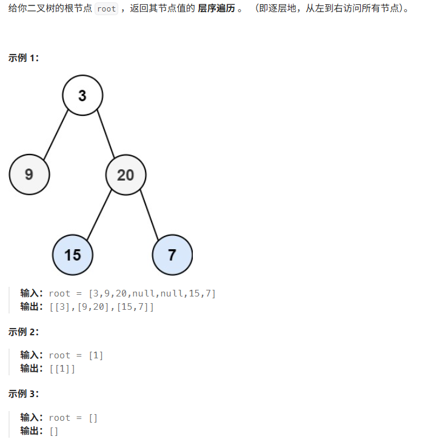

直接看代码：

```python
from collections import deque

class Solution:
    def levelOrder(self, root: Optional[TreeNode]) -> List[List[int]]:
        if not root:
            return [] # 一定要判断，否则把None加到队列里，并访问.val会报错
            
        ans = []
        q = deque()
        q.append(root)

        while q:
            sz = len(q)
            cur = []
            for _ in range(sz):
                node = q.popleft()
                cur.append(node.val)
                if node.left:
                    q.append(node.left)
                if node.right:
                    q.append(node.right)
            ans.append(cur.copy()) # 这里注意用copy

        return ans
```


## 108.将有序数组转换为二叉搜索树

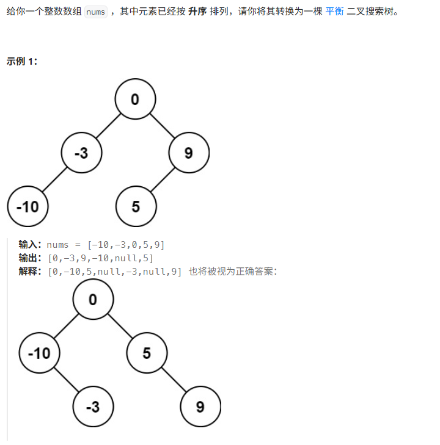

**平衡**：**平衡二叉树** 是指该树所有节点的左右子树的高度相差不超过 1。

所以，**将数组的中点作为根节点，左侧元素构成左子树，右侧元素构成右子树。**

易知，左右子树也要是平衡二叉树，所以这里用**递归调用**。

**边界条件**就是，**如果数组没有元素，则返回空节点。**


## 98.验证二叉搜索树


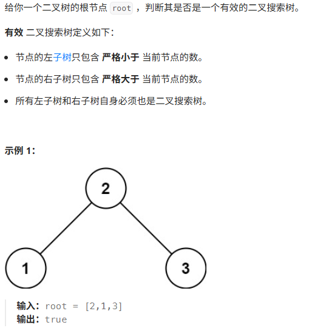

**遍历每个节点，看其数值是否在范围里**。当其数值在范围里，而且左右子树的数值也在其应在的范围内，返回True。


- 对于根节点，范围为：-inf到+inf
- 对于root.left，范围为：-inf到root.val，其中 -inf 是继承上一个范围的 下界
- 对于root.right，范围为：root.val到+inf，其中 +inf 是继承上一个范围的 上界

（None是二叉搜索树）


## 230.二叉搜索树中第K小的元素

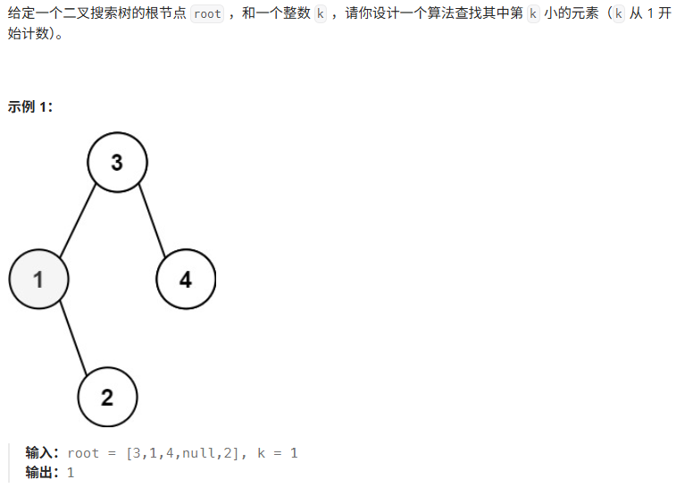

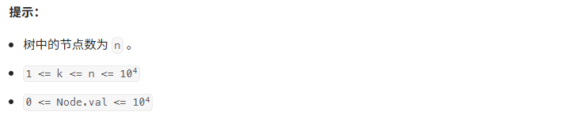

按照中序遍历，第K个节点的值就是第K小的元素。


## 199.二叉树的右视图

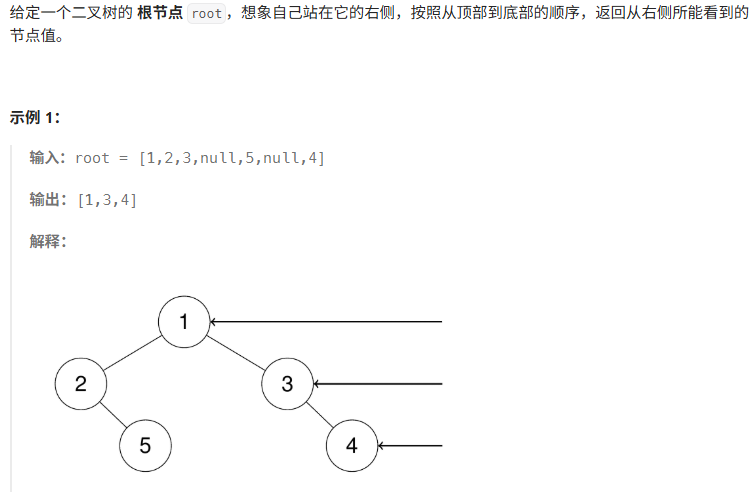

层序遍历即可，取每层的最后一个节点的值。


## 114.二叉树展开为链表

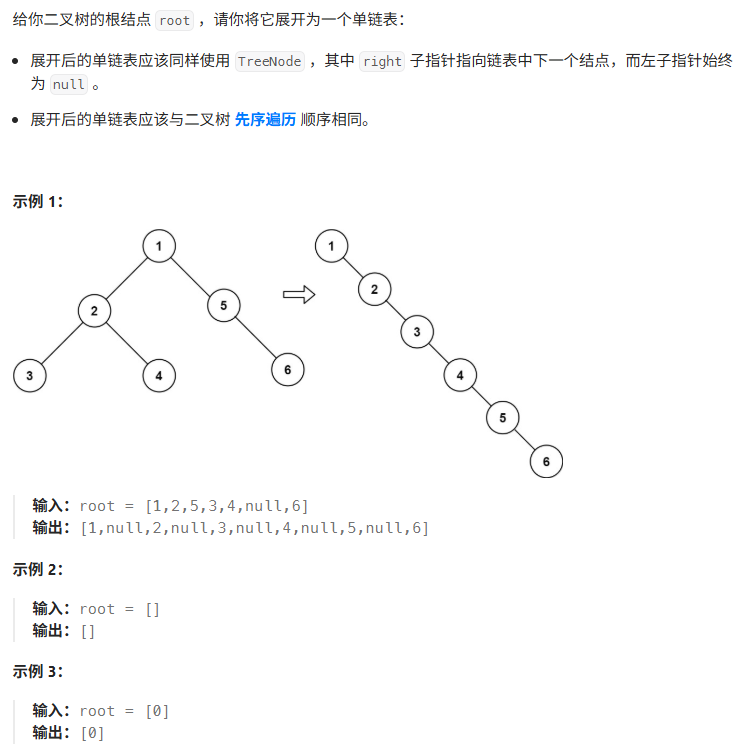

**递归**，左右子树展为链表同样调用该函数。此外，处理一些基础情况（边界情况）即可：

- root为None，直接返回；
- root的left和right都是None，直接返回；
- root的left是None，展开root.right；
- root的right是None，展开root.left，把left移到right，并把left变为None;
- root的left和right都存在，则展开root.left和root.right，把root.right接在root.left后面，之后把left移到right，把left变为None。

**注意：虽然无返回值，但每种基础情况写完后，都要return，避免跳到别的情况了。**


## 105.从前序与中序遍历序列构造二叉树

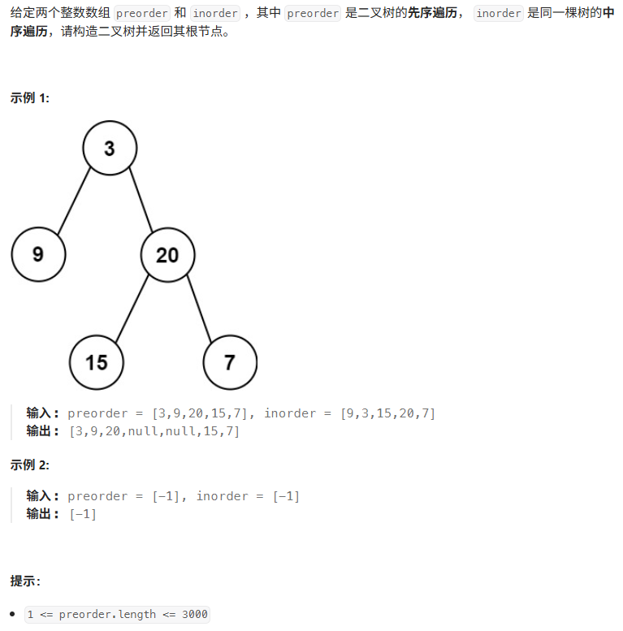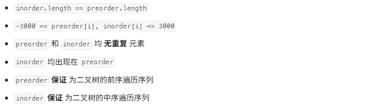

前序遍历的结果是：[**root.val**，root.left的前序遍历结果，root.right的前序遍历结果]

中序遍历的结果是：[root.left的中序遍历结果，**root.val**，root.right的中序遍历结果]

**发现：preorder的首元素是根节点，进而可以在inorder里找到根节点索引，确定左右子树的元素长度。**

找到根节点后，递归调用该函数，通过左子树的前序遍历结果和中序遍历结果吧左子树构造出来，右子树同理，再root接上两个子树即可。

### 优化根据值找索引（引入哈希）和数组切片（用索引代替数组成为函数参数）

在最开始就把inorder存为字典，key为数值，value为索引，这样后续找根节点的索引时只要o(1)的时间。

新建一个辅助函数，传入的preorder和inorder永远是最初的那两个，只不过多了prestart、preend，instart、inend，表示真实的数据范围。

这里在递归调用时，一定要检查prestart、preend，instart、inend是否正确。


## 437.路径总和3

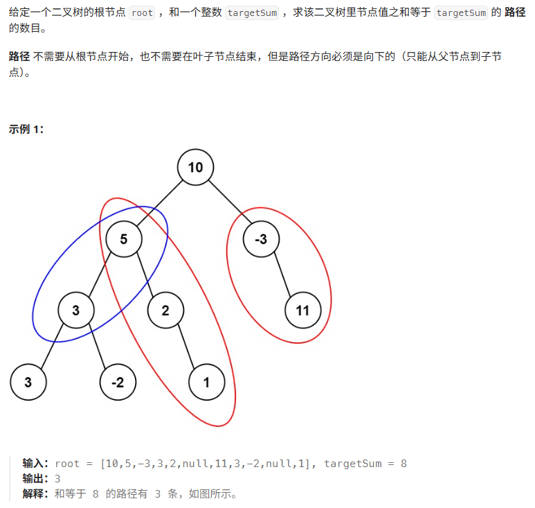

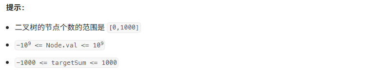

类似求 最大子数组和 的 **数组前缀和**技巧。

对于每个节点，往根节点的方向找，看有没有节点和它之间的路径节点和为目标数值。**回头看的思想**

遍历每个节点：

- 传递根节点到这个节点的上一个节点的总和（作为参数）；
- 节点非空，则把节点值加到路径和，得到根节点到该节点路径上所有节点的和 s；
- 然后把答案加上Counter里 s-target 的出现次数；
- 在Counter里把 s的出现次数 加一；
- 遍历左右子树；
- 在Counter里把 s的出现次数 减一。（因为要离开这个节点了，所以扣除）

**注意，在counter初始化后，要添加 counter[0]=1，这是为了让满足目标值的从根节点出发的路径被记录。**这个和前缀和数组得有s[0]=0一样（表示原数组的前0个元素和为0）。


## 236.二叉树的最近公共祖先

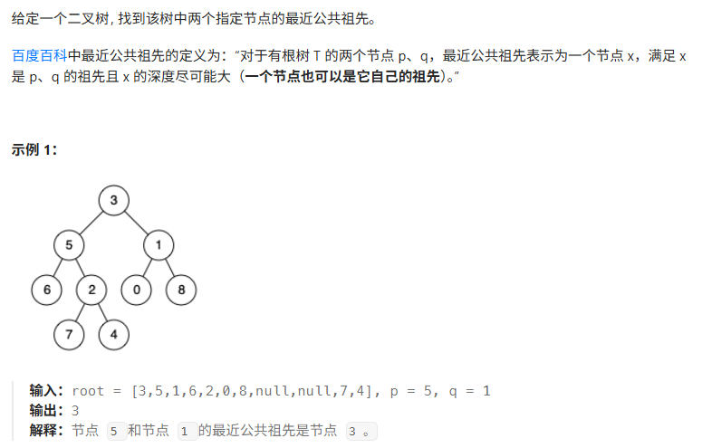

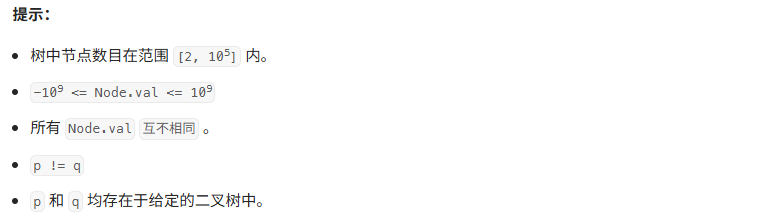

明确答案可能出现的方式：

- node为p（或q），q（或p）在node的左右子树中，则此时p（或q）为最近公共祖先；
- node不是p或q，p和q分别存在于node的左右子树里，则此时node为最近公共祖先。

遍历节点，三种情况：

- 节点为空，则返回None；

- 节点为p或q，则返回节点（因为它可能是最近公共祖先）；

- 节点非空，但又不是p或q，此时看它的左右子树递归调用的返回值：

  - 若左右子树的返回都是None，则返回None；

  - 若左右子树的返回都不是None（说明一个是p一个是q），则返回当前节点（最近公共祖先）;

  - 若左右子树的返回一个是None，一个不是None，则返回不是None的那个，因为它可能是p或q或最近公共祖先的节点。


## 124.二叉树中的最大路径和

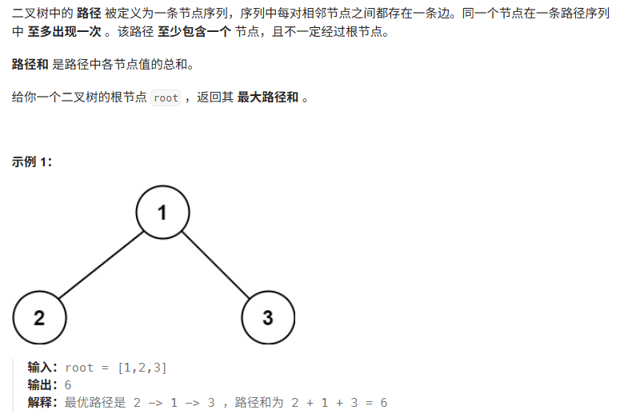

路径必有**拐点**，我们可以遍历每个节点，维护最大路径和ans，把该节点作为拐点的最大路径和与ans取max，最终ans为答案。

> [!NOTE]
>
> **如何计算某节点作为拐点的最大路径和？**
>
> 计算该节点的左子树向下延伸的最大路径和，右子树向下延伸的最大路径和，二者与当前节点的val相加，得到该节点作为拐点的最大路径和。
>
> 所以，用traverse来遍历每个节点，返回该节点向下延伸的最大路径和，如果该值小于0，则置0（即不经过这个节点了）。


